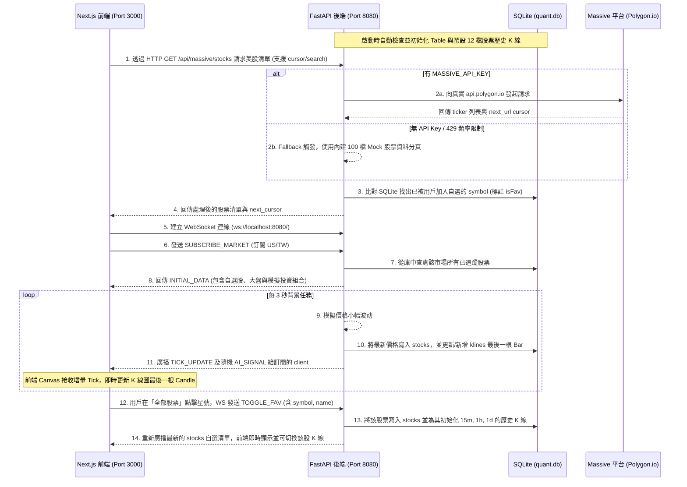

# QUANT-X B2B 智能股票回測儀表板 (QUANT-X B2B Quant Stock Dashboard)

QUANT-X 是一個高效能、即時的 B2B 量化交易策略回測與風險管理平台。本專案結合了 React 19 / Next.js 前端與 Python FastAPI 後端，透過 SQLite 持久化儲存與 WebSocket 低延遲雙向通訊，串接 Massive 平台 (Polygon.io) 提供美股與台股的即時報價、AI 策略診斷、多空情绪熱力圖，以及可滾動分頁的完整美股觀察清單。

---

## 1. 專案目的

本專案旨在提供金融機構、量化交易員與分析師一個現代化的儀表板：
1. **即時市場監控**：即時掌握美股/台股大盤指數與自選股的報價跳動。
2. **AI 量化策略回測**：內建 LSTM、Momentum (動量) 與 Bollinger (布林通道) 三大策略，並在 Canvas 圖表上標示出精確的買賣點與回測指標（如勝率、夏普值、最大回撤等）。
3. **無縫數據串接**：整合外部 Massive 金融數據平台，以 Infinite Scroll (滾動分頁) 機制動態載入全美股清單，並可隨時將其加入自選、自動初始化 K 線歷史數據。
4. **極致視覺美學**：採用暗色玻璃擬態 (Glassmorphism)、科幻網格 (Cyber Grid) 及微動畫，提供兼具實用與極致質感的 UI/UX。

---

## 2. 專案架構與數據流

本專案採用前後端分離架構，前端負責 UI 渲染與 Canvas 圖表繪製；後端負責 SQLite3 讀寫、定時價格模擬與 Massive 外部 API 的代理轉接。

### 2.1 系統目錄結構
```text
quant-stock-dashboard/
├── backend/                  # Python FastAPI 後端
│   ├── .env                  # 環境變數 (存放 Massive API Key)
│   ├── requirements.txt      # Python 套件依賴清單
│   ├── main.py               # FastAPI 主程式、WebSocket 廣播與定時任務
│   ├── db_manager.py         # SQLite 數據庫管理與 K 線數據生成器
│   └── massive_client.py     # Massive (Polygon.io) API 代理與 Fallback 機制
├── src/                      # Next.js 前端
│   ├── app/
│   │   ├── page.tsx          # 儀表板主頁 (WebSocket 管理、數據分發)
│   │   └── layout.tsx
│   ├── components/           # UI 元件庫
│   │   ├── WatchlistLeaderboard.tsx  # 觀察清單、篩選器與全部股票分頁 (Infinite Scroll)
│   │   ├── MarketOverview.tsx        # 頂部大盤指數狀態列
│   │   ├── AIStrategyConsole.tsx     # AI 回測控制台與即時訊號流水燈
│   │   ├── MarketSentiment.tsx       # 市場情緒指標與板塊熱力圖
│   │   └── PortfolioRisk.tsx         # 投資組合權重與風控 Beta 儀表板
│   ├── lib/
│   │   └── custom-kline-chart.ts     # 使用 HTML5 Canvas 自訂繪製的 K 線引擎
│   ├── services/
│   │   └── mockData.ts               # 前端備用 Mock 資料 (WS 離線時 fallback 用)
│   └── types/
│       └── index.ts                  # TypeScript 型別定義
├── quant.db                  # SQLite3 資料庫檔案
├── package.json              # 前端 Node.js 相依性及 scripts 啟動腳本
└── README.md                 # 專案說明書 (本檔案)
```

### 2.2 數據流向示意圖


---

## 3. 需求說明與實作细節

1. **整合 SQLite 資料庫**：
   - 建立 `stocks` 與 `klines` 表格。預設寫入美股 (AAPL, MSFT, TSLA, NVDA, GOOGL, AMZN) 與台股 (2330.TW, 2317.TW, 2454.TW, 2308.TW, 2881.TW, 2603.TW) 共 12 檔資料。
   - 歷史 K 線生成：為每檔股票生成 200 根涵蓋 15m (15分鐘線)、1h (一小時線)、1d (日線) 三種時間週期的隨機歷史 Candle 資料。
2. **WebSocket 程序與即時更新**：
   - 後端使用低延遲的非同步 WebSocket 監聽。
   - 背景任務每 3 秒對所有自選股的價格進行波動模擬。價格會精確地以 Transaction 方式批次同步寫入 SQLite 資料庫中。
   - 每 3 秒結束後，判斷時間是否跨越週期（如過了 1 小時），跨越時於 `klines` 插入新的 K 線 Bar，否則更新當前最後一根 K 線的最高、最低、收盤價與成交量，並將最新數據廣播給所有訂閱 Client。
3. **Massive 股票清單與無限滾動**：
   - 左側觀察清單中新增「全部美股」頁籤。
   - 提供搜尋功能，並在輸入時加入 **450ms Debounce** 避免輸入過程中頻繁發送 API 請求。
   - 監聽滾動事件，當可滾動高度不足 30px 時自動請求下一頁資料，實現 **Infinite Scroll**。
   - 價格 Hash 綁定：針對 Massive 拉下的所有非自選美股，後端依據其 Ticker 的 Hash 值為其計算出穩定的基準價格，再配合當前時間產生小幅隨機跳動，使之在翻頁與搜尋時價格維持穩定合理且具有流動感。
   - 當在此清單點選 `☆` 加入自選時，後端會將其存入 SQLite，並動態為其計算並初始化三種週期的歷史 K 線，讓用戶可以立刻在中間的主圖表上載入該股票的歷史行情與即時報價。

---

## 4. 使用技術與函式庫

### 4.1 前端 (Frontend)
- **Next.js 16.2.10 (React 19.2.4)**：使用 App Router 進行結構化路由與高效能 React 元件渲染。
- **TailwindCSS 4**：提供現代且高度客製化的 Cyberpunk 玻璃擬態風格。
- **HTML5 Canvas 繪圖引擎 (`custom-kline-chart.ts`)**：為了極致效能，本專案**未使用任何第三方重量級圖表庫 (如 Highcharts, ECharts 等)**，而是採用純 Canvas API 手寫實現 K 線、均線、成交量及 AI 買賣交易點標記的繪製，支援滑鼠拖曳滾動、雙指/滾輪以游標為中心縮放 K 線。
- **Web APIs**：使用原生的 WebSocket 連線、Scroll 監聽與防震處理。

### 4.2 後端 (Backend)
- **Python 3.13**：後端核心語言。
- **FastAPI 0.121.3**：提供極快、自動化 API 文件 (Swagger) 的非同步 Web 框架。
- **Uvicorn 0.38.0**：支援非同步的 ASGI 伺服器，負責承載 HTTP 與 WebSocket 流量。
- **aiosqlite 0.22.1**：提供非同步防阻塞的 SQLite 資料庫驅動，確保高併發下 WebSocket 價格更新時不會卡死主執行緒。
- **httpx 0.28.1**：非同步的 HTTP 客戶端，用於非同步發送 Massive.com API。
- **python-dotenv 1.0.1**：方便讀取本地 `.env` 檔案中的 API Key 設定。

---

## 5. 安裝與啟動指南

### 5.1 環境準備
- 已安裝 Python 3.11+。
- 已安裝 Node.js 18+ 與 npm。

### 5.2 後端設定與啟動
1. 進入 `backend` 資料夾：
   ```bash
   cd backend
   ```
2. 建立或修改 `.env` 檔案，填入您的 API Key（若無，可留空，系統將自動開啟 Fallback 模擬機制）：
   ```env
   MASSIVE_API_KEY=your_actual_polygon_or_massive_key_here
   ```
3. 在專案根目錄下，使用 `pip` 安裝後端依賴：
   ```bash
   pip install -r backend/requirements.txt
   ```
4. 啟動 FastAPI 後端伺服器 (Port 8080)：
   ```bash
   npm run py-backend
   ```
   *(或直接執行：`python -m uvicorn backend.main:app --port 8080`)*

### 5.3 前端設定與啟動
1. 在專案根目錄下安裝前端依賴：
   ```bash
   npm install
   ```
2. 啟動 Next.js 開發伺服器 (Port 3000)：
   ```bash
   npm run dev
   ```
3. 打開瀏覽器訪問：`http://localhost:3000` 即可體驗完整的量化儀表板。
